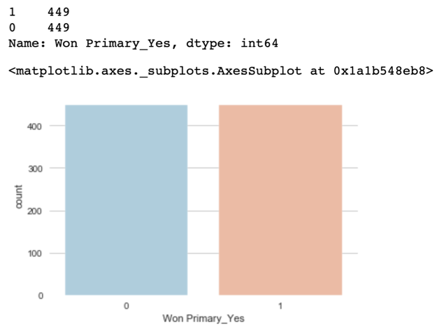
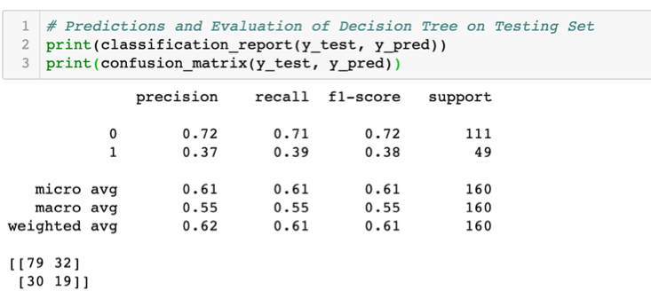

# Mod-3-Project-Dem-Primaries

## Project Goals

* With the 2020 Democratic Primaries on the horizon, and an unprecedently crowded field of candidates, who is best suited to become the nominee? I will attempt to create and apply different classification models to see if I can predict who is well positioned to win a democratic primary. I will base my model on election results and candidate information from the historic Democratic Primaries in the 2018 Midterm Elections.

## Data Sources

I used the following three data sources to compile datasets with information about the 2018 democratic primary candidates, demographic statistics about every county in the U.S., how each county votes in 2016.  

* Demographic statistics about every county in the U.S. : https://github.com/MEDSL/2018-elections-unoffical/blob/master/election-context-2018.md    
* How each county voted in the 2016 election :  https://dataverse.harvard.edu/dataset.xhtml?persistentId=doi:10.7910/DVN/PSKDUJ
* Information about the 2018 democratic primary candidates : https://github.com/fivethirtyeight/data/tree/master/primary-candidates-2018

## Data Cleaning 

* For each of the three data frames:
** Dealt with missing values.
** Deleted unnecessary columns.
** Changed column value formats, names and other “pandas adventures” so I could later merge the dataframes.
* Merged district data with individual county demographics to create a “district demographics” datafame.
* Merged Democratic Midterm Primary data with newly created “district demographics” dataframe in order to put all the information into one final dataframe. 
* Converted all values into uniform units of measurement. 

The cleaned dataframe had 800 rows and 32 features, including but not limited to:
* `Candidate`
* `District`
* `Won Primary` : “Yes” if the candidate won his or her primary and has advanced to November; “No” if he or she lost.
* `Gender`
* `Partisan Lean` : The FiveThirtyEight partisan lean of the district or state in which the election was held. Partisan leans are calculated by finding the average difference between how a state or district voted in the past two presidential elections and how the country voted overall, with 2016 results weighted 75 percent and 2012 results weighted 25 percent.
* `Race`: “White” if  the candidate is non-Hispanic white; “Nonwhite” if the candidate is Hispanic and/or any nonwhite race.
* `Vetern?`
* `LGBTQ?`
* `trump16`, `clinton16`, `obama12`, `romney12` : presidential candidate vote totals in 2012 and 2016.
* `black_pct` : non-Hispanic blacks as a percentage of total population.
* `female_pct` : females as a percentage of total population.
* `foreignborn_pct` : foreign-born population as a percentage of total population.
* `age29andunder_pct` : population 29 years or under as a percentage of total population.
* `median_hh_inc` : median household income in the past 12 months (in 2016 inflation-adjusted dollars).
* `lesshs_whites_pct` : white population with an education of less than a regular high school diploma as a percentage of total population.
* `rural_pct` : rural population as a percentage of total population. 

## Initial Observations From EDA

•	The are understandable more than double the candidates who did NOT win the primary than those who advanced to the general election. This causes a class imbalance that will be handled later on. 

•	Women won almost as many races as the men, even though there were disproportionally MORE men running. 

•	There’s a negative correlation between the % of uneducated whites and partisan lean.

•	There’s a positive correlation between median household income and partisan lean.

•	There’s a negative correlation between % of rural population and partisan lean.

•	As you can see below, candidates had a higher % to win in districts where partisan lean is less than 0. This now makes sense because of the Democratic candidates ran to CHALLENGE and REPLACE a Republican incumbents. 

## Feature Engineering 
•	Created two new features (Hillary Won? and Obama Won?), based on the 2016 and 2012 voting data:

•	Created dummy variables for categorical values:

•	Created three interaction variables:

## Feature Selection 

•	I used a Decision Tree Model for Feature Selection:

-	I removed unrelated features and ended up with a total of 25 features. 

## Model Fitting and Hyperparameter Tuning

### Train Test Split

### Fixing Class Imbalance

•	As we can see the training data is imbalance with 449 losses and 191 wins. 

#### Oversampling to fix the imbalance issue:

### Model Fitting

I used the following classification models: KNN, Decision Tree, Random Forest and Logistic Regression, all tuned with RandomizedSearchCV to find the best parameters. 

•	KNN Model:

-	Best params: {'weights': 'distance', 'n_neighbors': 5}
-	Best training accuracy: 0.805
-	Test set F1 score for best params: 0.433 

- 21 TP
- 27 FP (Type I Error)
- 28 FN (Type II Error)
- 84 TN

•	Decision Tree Model:

-	Best params: {'min_samples_split': 9, 'min_impurity_decrease': 0, 'max_features': 2, 'max_depth': 17, 'criterion': 'entropy'}
-	Best training accuracy: 0.678
-	Test set F1 score for best params: 0.380 

- 19 TP
- 32 FP (Type I Error)
- 30 FN (Type II Error)
- 79 TN

•	Random Forest Model:

-	Best params: {'n_estimators': 300, 'min_samples_leaf': 0.05, 'max_features': 0.33, 'max_depth': 7}
-	Test Accuracy score:  0.65
-	Test F1 score:  0.540983606557377

- 33 TP
- 40 FP (Type I Error)
- 16 FN (Type II Error)
- 71 TN

•	Logistic Model- The Best and Final Model

- 31 TP
- 32 FP (Type I Error)
- 18 FN (Type II Error)
- 79 TN

Most significant coefficients: 

-	`black_pct`, 0.9262263541620813)

-	`hispanic_pct`, 0.8965214046937131)

-	`lesscollege_whites_pct`, 0.6906162626387121)

-	`Gender_Male`, -0.5819255516697597)

-	`Elected Official?_Yes`, 0.40687264120290206)

-	`age65andolder_pct`, 0.2766392709309708)

-	`Partisan Lean X HH Income`, 0.2379032744412554)

-	`foreignborn_pct`, 0.2203907397440936)

## Next Steps:

* Use boosting classifiers such as XGBoost and Adaboosting.
* Interaction variables seemed to be quite significant in “Feature Importance”, so I should create more and see if that will improve any of the models.
* As you can see below a lot of the data in the independent variables is not normalized, so see if normalizing it will improve and of the models.
* Try and see if I could get policy positions (i.e. support for Medicare For All, taxing the wealthy, immigration) for the candidates and see if ideology has had an affect on voting patterns. 

